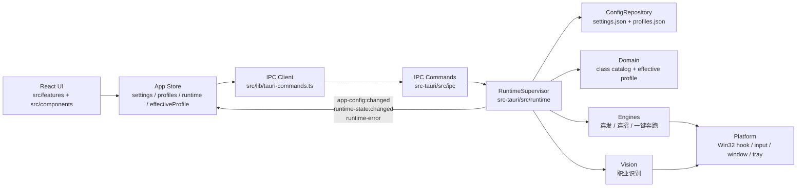

# DNF按键助手 架构指南

本文档描述当前 Hermes 风格重组后的项目架构。目标是让后端统一管理配置、职业目录、有效配置和运行时状态，前端只负责展示状态、编辑表单和发送用户意图。

## Overview

DNF按键助手是一个 Tauri 2 桌面应用：

- 前端使用 React 展示主窗口、悬浮窗和设置页面。
- IPC 层只暴露用户意图式命令，例如加载启动快照、保存设置、保存功能配置、选择当前配置、启动或停止助手。
- Rust 后端持有持久化配置、职业目录、有效配置计算和运行时协调。
- Win32 相关能力封装在 `platform/` 和 `engines/`，页面不会直接知道钩子、输入模拟或窗口门禁细节。



## Glossary

- **Settings**：本机程序设置，对应 `{exe_dir}/configs/settings.json`。
- **Profiles**：功能、玩法配置和当前配置选择状态，对应 `{exe_dir}/configs/profiles.json`，未来导入/导出默认围绕它展开。
- **Class Catalog**：后端维护的职业目录和职业识别 ID 映射，前端只消费快照。
- **Active Config**：当前选中的职业配置、自定义配置或全局配置。
- **Effective Profile**：后端根据 `profiles + class catalog` 计算出的实际生效连发键和连招。
- **Runtime State**：助手、职业识别、切换连发等当前运行态。运行态不由页面各自推断。
- **LegacyAppConfig**：旧版总配置对象，只用于读取旧 `app-config.json` 和后端兼容测试，不再是前端或后端主路径模型。

## Directory Layout

### Frontend

```text
src/
  main.tsx                         React 入口
  app.tsx                          主应用装配、页面选择、全局消息
  components/
    app-shell.tsx                  全局布局
    app-ui.tsx                     通用 UI 组件
    global-status-bar.tsx          底部全局状态栏
  features/
    autofire/                      按键连发页面和动作 hook
    combo/                         一键连招页面和动作 hook
    auto-run/                      一键奔跑页面和动作 hook
    profile-management/            职业和自定义配置管理
    settings/                      程序设置
    diagnostics/                   运行诊断
    floating-control/              悬浮窗视图和轻量操作
  store/
    app-provider.tsx               bootstrap、事件订阅、保存回滚
    app-store.ts                   reducer、selectors、初始状态
    app-store-context.ts           store context 和更新入口类型
  lib/
    tauri-commands.ts              唯一 IPC client
    app-events.ts                  前后端事件名
    config.ts                      纯配置 helper
    keys.ts                        按键选项和 VK 工具
    floating-control.ts            悬浮窗共享常量
  generated/
    backend-types.ts               ts-rs 从 Rust DTO 生成的跨端契约
  types/
    app-config.ts                  generated DTO re-export 和前端本地 helper
    app-error.ts                   结构化后端错误与前端 transport 兜底错误
```

前端 store 保存真实状态片：

- `settings`
- `profiles`
- `classCategories`
- `profileDisplay`
- `runtime`
- `effectiveProfile`

前端不再保存合成 `LegacyAppConfig`，也不维护职业数据表或配置展示规则。配置选择器选项、职业显示/隐藏、已配置标记等由后端 `profileDisplay` 快照下发。
跨端 DTO 由 Rust `ts-rs` 生成到 `src/generated/backend-types.ts`，前端手写类型只保留本地 UI helper 和 transport 错误兜底。

### Backend

```text
src-tauri/src/
  app/                             Tauri 装配、AppState、事件 helper
  ipc/                             用户意图式命令分组
  config/                          配置 schema、默认值、迁移、校验、仓库、路径
  domain/                          职业目录、识别 ID 映射、有效配置和展示快照计算
  runtime/                         RuntimeSupervisor 和助手运行态协调
  vision/                          职业识别和未来画面状态识别边界
  engines/                         连发、连招、一键奔跑执行器
  platform/                        Win32 hook、键盘输入、窗口门禁、托盘、日志、启动项
```

后端主路径以 `SettingsConfig + ProfilesConfig` 为输入。`LegacyAppConfig` 只在 `config/migration.rs` 和相关测试里承接旧配置迁移。

## Configuration Model

配置拆成两份文件：

```text
{exe_dir}/configs/settings.json
{exe_dir}/configs/profiles.json
```

`settings.json` 包含本机程序设置：

- `launchAtStartup`
- `startMinimized`
- `minimizeToTray`
- `openFloatingControlOnStart`
- `logLevel`
- `toggleHotkey`
- `detection`

`profiles.json` 包含功能、玩法配置和配置选择状态：

- `globalKeys`
- `comboDefs`
- `classes`
- `customConfigs`
- `activeClassId`
- `hiddenClassIds`
- `autoRun`

其中 `autoRun` 包含：

- `enabled`
- `leftVk`
- `rightVk`
- `pulseDelayMs`

旧版 `{exe_dir}/configs/app-config.json` 仍可作为迁移来源。启动后后端会读取 legacy 配置并写出拆分后的 `settings.json` 和 `profiles.json`，后续保存不再写回旧文件。

`settings.json` 和 `profiles.json` 各自有 version、默认值、校验和回退逻辑。某一份文件损坏时，只回退该文件，不丢弃另一份有效配置。

## IPC Contract

前端只通过 `src/lib/tauri-commands.ts` 调用后端。命令按职责拆在 `src-tauri/src/ipc/`：

- `loadBootstrap()`：启动入口，一次返回 `settings`、`profiles`、`classCategories`、`runtime`、`effectiveProfile`。
- `saveSettings(settings)`：保存程序设置，并由后端同步检测服务、启动项、日志等级等副作用。
- Profile 意图命令：`updateGlobalKeys()`、`updateProfileKeys()`、`updateProfileEffectRule()`、`updateProfileCombos()`、`updateAutoRun()`、`addCustomConfig()`、`deleteCustomConfig()`、`setClassHidden()`。
- `selectActiveConfig(activeClassId)`：统一切换当前配置。
- `setAssistantRunning(running)`：启动或停止助手。
- `loadRuntimeDiagnostics()`：读取运行诊断。
- `restartAsAdmin()` 等纯系统操作保留在 system 分组；日志等级和开机启动不再有单独 IPC，随 `saveSettings()` 由后端应用。

已废弃的底层运行时命令不应重新出现在前端页面中，例如 `startDetection`、`stopDetection`、`startAutofire`、`stopAutofire`、`setRuntimeProfile`、`setRuntimeKeys`。
整份 `profiles.json` 替换不作为公开 IPC 暴露；未来导入功能需要新增明确的 import command，并在后端内部调用 `replace_profiles_for_import`。

IPC fallible 命令统一返回结构化 `AppError`：

- `kind`：稳定错误类别，例如 `validation`、`config`、`runtime`、`window`。
- `message`：可直接展示给用户的中文错误。

前端不兼容旧字符串业务错误；只有 JS/Tauri transport 失败会在前端映射为本地 `transport` 错误。

## Event Model

后端通过事件把状态变化推回前端：

- `app-config:changed`：配置保存或 active config 切换后，推送 `AppStateSnapshot`。
- `runtime-state:changed`：运行态或有效配置变化后，推送 runtime snapshot。
- `runtime-error`：运行时错误消息。

前端 `AppProvider` 统一订阅这些事件，并更新 store。页面不直接监听底层引擎事件。
所有配置快照和运行态快照都带 `revision`。后端在用户可见的配置或运行态变化时递增 revision；前端收到旧 revision 的事件会直接丢弃，避免并发保存或多窗口事件乱序覆盖新状态。

## Runtime Flow

### Startup

1. Rust 创建 `AppState`，其中包含 `ConfigRepository`、`AssistantRuntime`、`DetectionRuntime` 和 `RuntimeSupervisor`。
2. `ConfigRepository` 加载 `settings.json` 和 `profiles.json`，必要时从旧 `app-config.json` 迁移。
3. `RuntimeSupervisor::initialize()` 根据当前配置同步职业识别服务。
4. 前端调用 `loadBootstrap()`，拿到配置、职业目录、运行态和有效配置。
5. `AppProvider` 写入 store，页面开始渲染。

### Save Settings

1. 页面通过 feature action 生成下一份 `SettingsConfig`。
2. `AppProvider` 乐观更新 store，并调用 `saveSettings()`。
3. 后端校验并保存 `settings.json`。
4. `RuntimeSupervisor` 根据新设置同步检测服务、启动项、日志等级等相关运行态。
5. 后端发出 `app-config:changed` 和 `runtime-state:changed`。
6. 保存失败时前端回滚到旧 store 状态并展示错误。

### Save Profiles

1. 页面通过 feature action 发出具体用户意图，例如更新连发键、更新连招、隐藏职业或修改一键奔跑。
2. 后端基于当前 `profiles.json` 应用该意图，校验并保存。
3. `RuntimeSupervisor` 重新计算 `effectiveProfile`。
4. 如果助手正在运行，连发、连招、一键奔跑配置会刷新到对应 engine。
5. 后端发出配置和运行态事件。

### Select Active Config

所有切换当前配置的来源都走 `selectActiveConfig()`：

- 主窗口手动选择。
- 悬浮窗选择。
- 职业识别自动选择。

后端会归一化目标 id，重新计算 `effectiveProfile`，并刷新运行中的助手。

## Domain Rules

`domain/` 是后端业务规则层：

- 职业目录和职业识别 ID 映射只在后端维护。
- `activeClassId` 可以指向职业配置、自定义配置或 `null` 全局配置。
- `EffectRule::GlobalAndClass` 会合并全局连发键和当前配置连发键。
- `EffectRule::ClassOnly` 只使用当前配置连发键。
- 重复 VK 按“后者覆盖前者”的规则生成有效连发键。
- 有效连招只来自当前职业或自定义配置，根级 `comboDefs` 当前保留兼容和未来全局连招扩展。

## Runtime Supervisor

`RuntimeSupervisor` 是运行时唯一协调者，具体写盘和窗口副作用拆到 service：

- `SettingsService`：保存 settings、归一化、开机启动和日志等级副作用回滚。
- `ProfileService`：连发、连招、一键奔跑、自定义配置、隐藏职业和 active config 等 profile 意图。
- `WindowService`：主窗口最小化/关闭、悬浮窗显示/隐藏和位置保存。

`RuntimeSupervisor` 保留编排职责：

- 处理助手启动和停止。
- 保存 settings/profiles 后刷新运行时。
- active config 切换后刷新有效配置。
- 职业识别切配置后通知前端和运行时。
- 根据 `settings.detection.enabled` 懒加载或停止 `DetectionRuntime`。
- 递增 revision、生成 snapshot、发送 `app-config:changed` / `runtime-state:changed` / `runtime-error`。

页面不直接启动连发、连招、一键奔跑或检测引擎。

## Engines And Platform

`engines/` 按功能表达运行逻辑：

- `autofire.rs`：按住连发和切换连发。
- `combo.rs`：一键连招。
- `autorun.rs`：一键奔跑。

`platform/` 封装系统能力：

- `hook.rs`：全局键盘钩子。
- `keyboard.rs`：SendInput 和游戏输入。
- `window.rs`：DNF 前台窗口门禁，debug 保留 Notepad。
- `tray.rs`：托盘菜单。
- `hotkey.rs`：全局快捷键。
- `startup.rs`：开机启动。
- `logging.rs`：日志。
- `notify.rs`：系统提示。

## Vision Boundary

`vision/` 当前只承接职业识别能力：

- 检测服务按 `settings.detection.enabled` 懒加载。
- 捕获和扫描逻辑在后端运行。
- 识别结果通过统一 active config 入口切换配置。
- 捕获错误、失焦、无匹配等状态由后端运行时处理，前端不自行切换到全局配置。

未来城镇、聊天框、副本等游戏画面状态识别必须走 `vision -> runtime policy -> engines` 链路：

- `vision/` 只产出画面事实，例如职业识别、城镇状态、聊天框状态、副本状态和捕获错误。
- `runtime/` 根据画面事实、用户设置和当前配置计算运行策略，例如哪些 engine 应该启动、暂停或保持原样。
- `engines/` 只接收运行策略和有效配置，不反向判断页面状态。
- 前端页面只展示画面状态和编辑策略设置，不重新承载 detection 判断、配置切换或 engine 启停逻辑。

## Frontend Boundaries

前端可以做：

- 展示后端快照。
- 编辑 settings/profiles 表单。
- 做临时 UI 状态，例如当前页面、搜索词、输入框录入状态。
- 调用 feature action 保存用户意图。

前端不应做：

- 维护职业数据表。
- 合成 `LegacyAppConfig` 再拆分。
- 直接计算最终生效 keys/combos 作为运行时依据。
- 直接计算配置选择器选项、职业显示/隐藏、已配置标记等展示规则。
- 直接调用底层 runtime 命令启动具体引擎。
- 在页面里散落 Tauri invoke/listen。
- 直接用 Tauri window API 决定主窗口或悬浮窗生命周期。

## Floating Control

悬浮窗是全局唯一的 `floating-control` 窗口，由后端 `platform/floating_control.rs` 创建、显示、隐藏和恢复位置，入口为 `/?view=floating-control`。前端只负责渲染悬浮窗内容、调整尺寸，并把拖动后的新位置回传后端保存。

主窗口最小化、关闭以及关闭前隐藏悬浮窗也归后端 `RuntimeSupervisor` 管理。前端标题栏只发送 `minimizeMainWindow()` / `closeMainWindow()` 用户意图。

托盘和主窗口共享同一条后端运行态链路：

1. 主窗口调用 `showFloatingControlWindow()` / `hideFloatingControlWindow()`，托盘直接调用 `RuntimeSupervisor`。
2. `RuntimeSupervisor` 调用 `FloatingControlRuntime` 创建或隐藏窗口。
3. 后端把悬浮窗位置保存到 `settings.json`，并把 `floatingControlVisible` 放进 `runtime-state:changed`。
4. 前端 store 和托盘菜单都消费同一份运行态快照。
5. 设置项 `openFloatingControlOnStart` 只决定启动时是否打开悬浮窗，不代表当前可见性。

不要恢复旧的 `floating-control:toggle-request` / `floating-control:visibility-changed` 前端同步链路。

## Extension Points

### 配置导入/导出

未来导入/导出默认围绕 `profiles.json`：

- 导出功能配置、职业配置和自定义配置。
- 不导出本机启动项、日志等级等 settings 状态，除非未来有明确需求。

### 游戏画面状态识别

未来新增城镇、聊天框、副本等状态识别时：

- 识别逻辑放在 `vision/`。
- 状态决策放在 `runtime/`。
- 前端只展示状态和设置策略。
- 连发、连招、一键奔跑是否运行由 `RuntimeSupervisor` 决定。

## Design Decisions

- 后端是业务事实来源，前端是展示和操作入口。
- 配置拆分为 settings/profiles，避免本机设置和可导入配置混在一起。
- 职业目录放后端，避免职业 ID 和识别 ID 在前后端各维护一份。
- `RuntimeSupervisor` 统一处理运行时联动，避免每个页面或功能各自判断启动停止。
- `LegacyAppConfig` 保留为 legacy 迁移桥，不作为新 API 契约。
- `AppError` 保留稳定 `kind/message` 契约，避免后端内部错误类型退化成字符串。
- `ts-rs` 生成跨端 DTO，避免前端手写契约和 Rust 结构体漂移。
- 浏览器静态预览只验证布局，不提供后端业务 mock。

## Verification

架构相关改动至少运行：

```bash
pnpm types:check
pnpm typecheck
pnpm rust:check
```

涉及 Win32 钩子、SendInput、托盘、职业识别或安装包资源时，还需要在 Windows Tauri 应用中做 smoke test。
